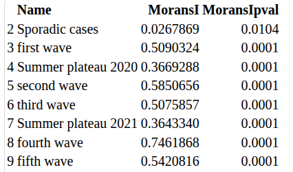
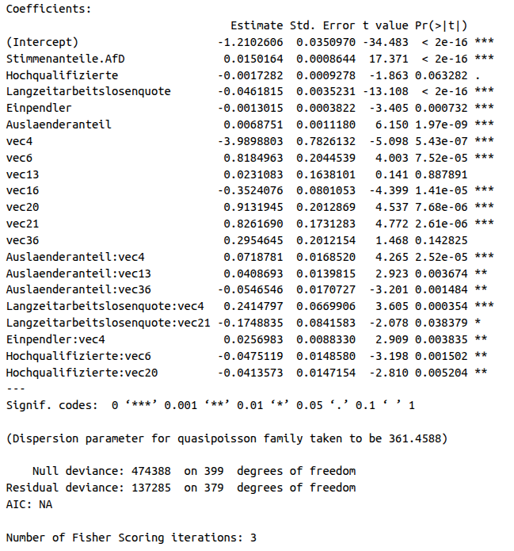
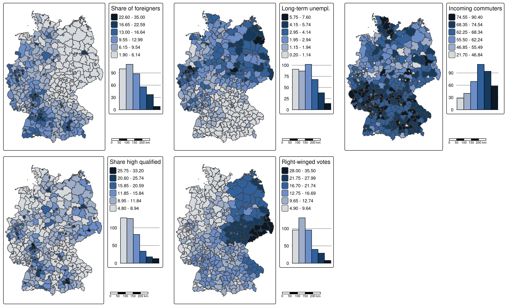
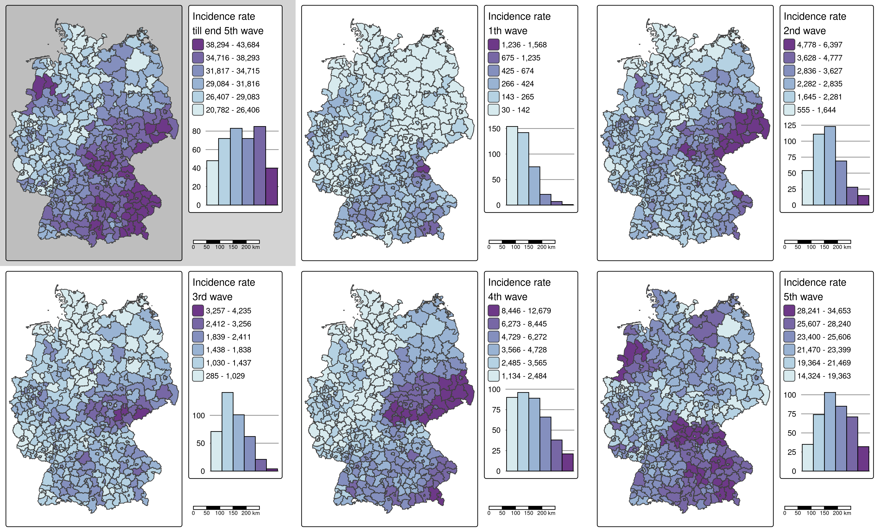
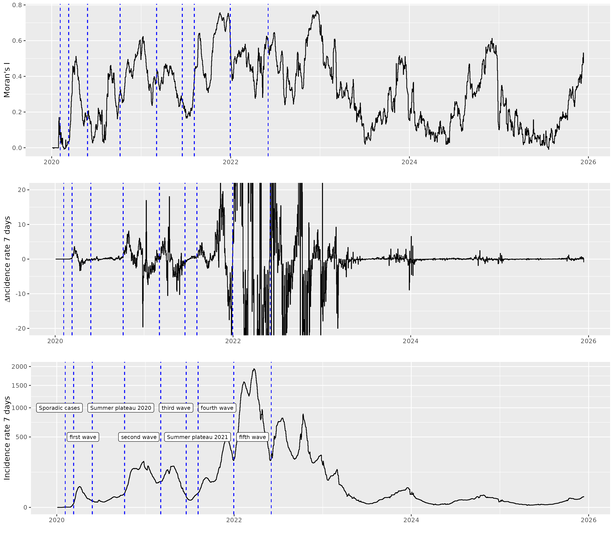
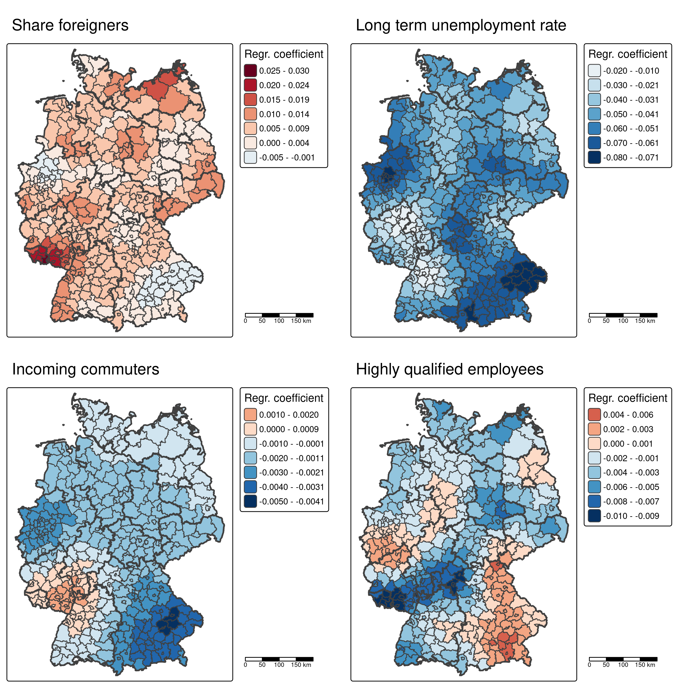
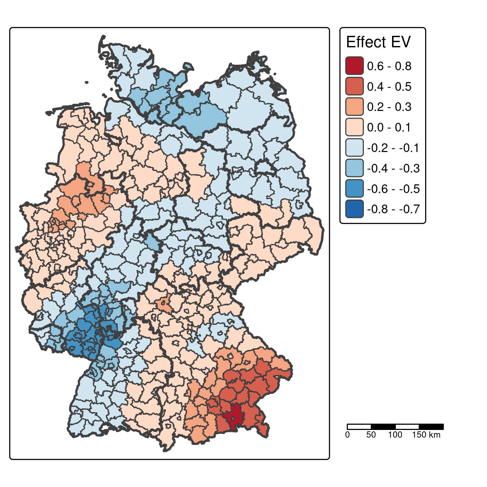
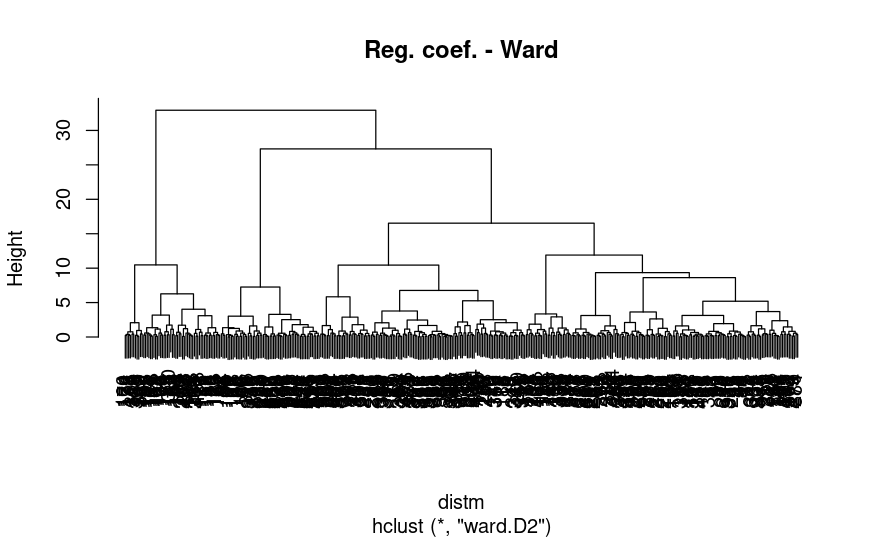
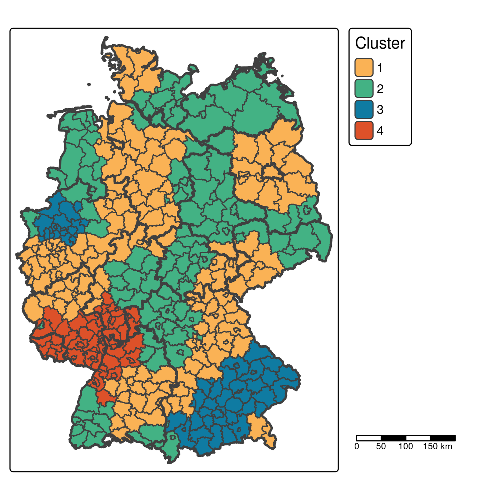

```{r setup, include=FALSE}
knitr::opts_chunk$set(echo = TRUE)

def.chunk.hook  <- knitr::knit_hooks$get("chunk")
knitr::knit_hooks$set(chunk = function(x, options) {
  x <- def.chunk.hook(x, options)
  ifelse(options$size != "normalsize", paste0("\n \\", options$size,"\n\n", x, "\n\n \\normalsize"), x)
})
```

```{r logo, eval=TRUE, echo=FALSE, message=FALSE, warning=FALSE, fig.align='center', out.width='0.3\\linewidth', fig.pos='H'}
temp <- tempfile(fileext = ".pdf")
download.file(url = "https://reproducible-agile.github.io/public/images/reproducible-AGILE-logo-square.pdf", destfile = temp)
knitr::include_graphics(temp)
```

This report is part of the reproducibility review at the AGILE conference.
For more information see [https://reproducible-agile.github.io/](https://reproducible-agile.github.io/).
This document is published on OSF at [https://doi.org/10.17605/OSF.IO/DZURB](https://doi.org/10.17605/OSF.IO/DZURB).
To cite the report use 

Koukouraki, E. (2026, April).  Reproducibility review of: Analysis of the spatial and temporal pattern of COVID-19 incidence rate across Germany. [https://doi.org/10.17605/OSF.IO/DZURB](https://doi.org/10.17605/OSF.IO/DZURB)


# Reviewed paper

ADD FULL CITATION

# Summary

The paper investigates the effect of five socio-economic factors (votes for right-winged populist party, share of foreigners, share of highly qualified employees, long-term unemployment rate, share of incoming commuters) on different phases of the COVID-19 pandemic. The study uses data from the Robert Koch Institute analysed with a quasi-Poisson generalized linear model using spatial eigenvector mapping and performed hierarchical clustering on the regression coefficients.  The authors shared the scripts via an anonymous GitHub link: [https://anonymous.4open.science/r/covid19germany-5403](https://anonymous.4open.science/r/covid19germany-5403). For the purposes of this reproducibility review, we verified the functionality of all scripts and the reported results in Figures 1-7 and in Tables 2 and 3. The reproduced results were mostly in accordance with the reported results and therefore the reproduction of the paper is considered **partially successful**.

\clearpage

# Reproducibility reviewer notes

## Data and code sharing

The data, code, intermediate results and documented instructions to reproduce this paper were initially shared with the reproducibility committee with the following anonymous GitHub link [https://anonymous.4open.science/r/covid19germany-5403](https://anonymous.4open.science/r/covid19germany-5403). 
The authors have licensed this repository under the GNU General Public License. 
The materials are packed as a single ZIP file, which contains a README file, an R project file, three R Markdown notebooks and one directory with some raw and intermediate data. The R Markdown files contain the code for pre-processing the data, calculating the spatial autocorrelation time series, performing regression modelling, mapping the spatial eigenvectors and performing hierarchical clustering. 
Under the *data* directory are data files (in .csv or .Rdata format) which are necessary to run the aforementioned scripts.
This repository, as provided by the authors, has been copied to the storage of the reproducibility review repository under _materials shared by the authors_ (see [https://osf.io/dzurb/files/osfstorage](https://osf.io/dzurb/files/osfstorage)).

## Computational environment

We followed the requirements mentioned in the README file to recreate the computational environment, including the R package versions, as closely as possible. 
We used R version 4.4.1 and RStudio 2026.01.1+403. Most packages had to be installed manually, one by one. Some also required additional packages or libraries to be installed on the system for successful installation.
Ultimately,  we managed to install the following versions of the R packages listed in the requirements:

- rmdformats 1.0.4
- tidyverse 2.0.0
- ggplot2 4.0.2
- GGally 2.4.0
- ggpubr 0.6.3
- spatialreg 1.4.2
- lubridate 1.9.5
- sf 1.1.0
- spdep 1.4.2
- tmap 4.2
- readODS 2.3.2

Moreover we had GDAL 3.4.1, GEOS 3.10.2, PROJ 8.2.1, and sqlite3 3.37.2 installed on our system. 
The hardware on which the reproduction was run consists of 16.0 GiB of memory and an i7-1185G7 @ 3.00GHz × 8 processor. The operating system is Ubuntu 22.04.5 LTS. 

## Runtime

The code was executed chunk by chunk in the three R Markdown notebooks. All code chunks were executed quickly, except from the one that calculates the global Moran's I time series in the SAC.Rmd file (lines 78-114), which returned after around half an hour.

## Reproduction efforts

The repository was overall tidy and well organized. 
The data links in the manuscript were provided in section 3.1, namely _Data_, but for the Robert Koch Institute data, the link was wrong and pointed to 404 (footnote 1), and for the socioeconomic data from inkar.de (footnote 2), the reader would need more instructions beyond the link to find the right dataset. 

We confirmed the functionality of all three .Rmd files. For data_preprocessing.Rmd, the execution was possible using the intermediate results provided by the authors in the anonymised GitHub repository. The workflow reproduced a similar covidKreise.Rdata file compared to the one provided by the authors, but not identical. One difference that we could quickly spot is that there is an additional "LKZ" column in the reproduced file.
In the case of inkarKreisstatistik_preprocessed.Rdata, it was not obvious how to get from the raw to the pre-processed data from data_preprocessing.Rmd alone.

In case the data_analysis.Rmd was executed first, without having executed the data_preprocessing.Rmd before, the shapefile with the federal states will not be in the data directory and this will cause an error (lines 34-36).
There was also a typo in line 856 (it should be method="euclidean"), which we had to correct on our end in order to proceed.
Finally, the VIF for the Auslanderanteil was found equal to 2.34 instead of the reported 2.4 (lines 108-110 of data_analysis.Rmd), which we consider minor as a difference.

## Reproduced tables

Some minor differences were spotted in the reproduction of Tables 2 and 3, which do not affect the interpretation of the results. In Table 2, the p-value for the "Sporadic cases" was found equal to 0.0104, as opposed to the reported 0.0127. In Table 3, there are some minor rounding differences compared to the manuscript (e.g., Auslaenderanteil found 0.0068, instead of 0.0069).

```{r, echo=FALSE,out.width="40%",fig.cap="Global Moran’s I for the aggregated incidence rate of each pandemic period. Corresponds to Table 2 of the reproduced paper. Output of lines 139-158 of SAC.Rmd.",fig.show='hold',fig.align='center'}

```

```{r, echo=FALSE,out.width="70%",fig.cap="Quasi-Poisson generalized linear regression model. Corresponds to Table 3 of the reproduced paper. Output of line 471 of $data_analysis.Rmd$.",fig.show='hold',fig.align='center'}

```


## Reproduced figures

All figures were perfectly reproduced, except for the dendrogram  (Figure 6 in the manuscript). In this case the output figure had no dimensions and all the labels overlap, so this result could not be verified.

```{r, echo=FALSE,out.width="100%",fig.cap="Predictor maps. Corresponds to Figure 1 of the reproduced paper.",fig.show='hold',fig.align='center'}

```

```{r, echo=FALSE,out.width="100%",fig.cap="Response maps. Corresponds to Figure 2 of the reproduced paper.",fig.show='hold',fig.align='center'}

```

```{r, echo=FALSE,out.width="80%",fig.cap="Moran's I time series. Corresponds to Figure 3 of the reproduced paper.",fig.show='hold',fig.align='center'}

```

```{r, echo=FALSE,out.width="80%",fig.cap="Regression coefficient maps. Corresponds to Figure 4 of the reproduced paper.",fig.show='hold',fig.align='center'}

```

```{r, echo=FALSE,out.width="50%",fig.cap="Eigenvector effect map shown at link scale. Corresponds to Figure 5 of the reproduced paper.", fig.show='hold', fig.align='center'}

```

```{r, echo=FALSE,out.width="80%",fig.cap="Failed reproduction of the dendrogram. Corresponds to Figure 6 of the reproduced paper.",fig.show='hold',fig.align='center'}

```

```{r, echo=FALSE,out.width="50%",fig.cap="Districts clustered by the spatial varying regression coefficients. Corresponds to Figure 7 of the reproduced paper.",fig.show='hold',fig.align='center'}

```

## Communication with the author

We communicated these remarks to the authors by email, suggesting improvements to both the repository and the manuscript. The corresponding author responded fast and positively, but we ultimately received no further updates before the reproducibility review had to be completed. 


```{r, echo=FALSE, eval=FALSE, results='hide'}
# create ZIP of reproduction files and upload to OSF
library("zip")
library("here")

zipfile <- here::here("PATH/agile-reproreview-2026-012.zip")
file.remove(zipfile)
zip::zipr(zipfile,
          here::here("2020-018/files to add to the zip, if any"))

library("osfr") # See docs at https://docs.ropensci.org/osfr/
# OSF_PAT is in .Renviron in parent directory
# We cannot use osfr to create a new component (with osfr::osf_create_component(x = osfr::osf_retrieve_node("6k5fh"), ...) because that will set the storage location to outside Europe.

# retrieve project
project <- osfr::osf_retrieve_node("OSF ID")

# upload files
osfr::osf_upload(x = project,
                 conflicts = "overwrite",
                 path = c(list.files(here::here("PATH"),
                                     pattern = "agile-reproreview-.*(pdf$|Rmd$|zip$)",
                                     full.names = TRUE),
                          "COPYRIGHT"
                          )
                 )
```